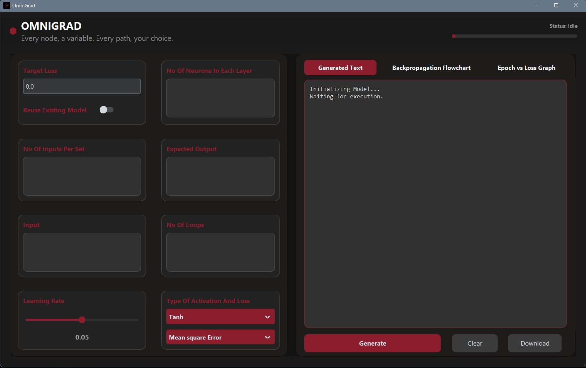
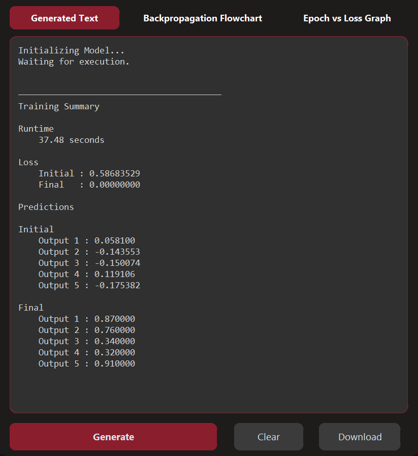
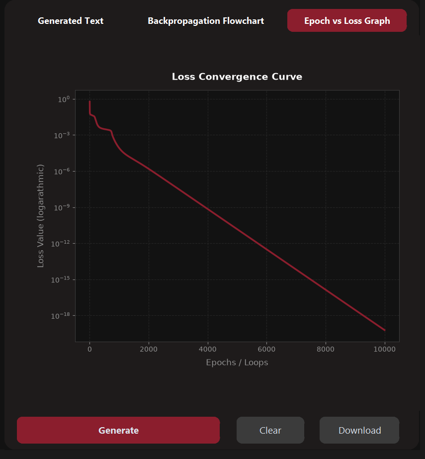
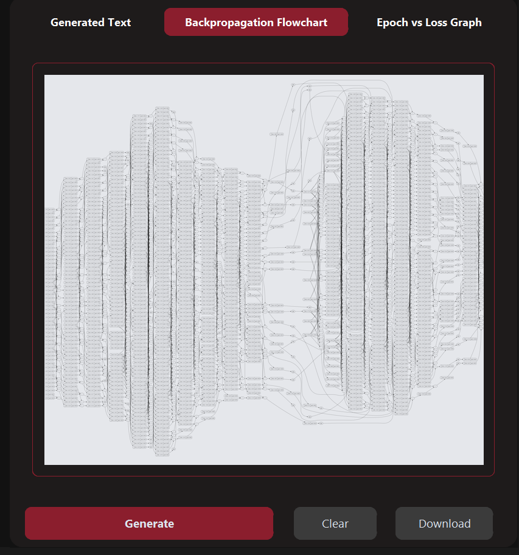
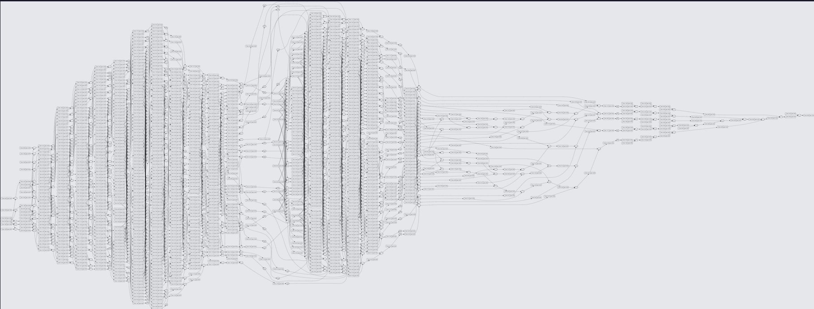

<p align="center">
  
</p>

<h1 align="center">🧠 OmniGrad</h1>

<p align="center">
An interactive desktop application for building, training, and visualizing neural networks from scratch.
</p>

<p align="center">
Inspired by <b>Micrograd</b> by <b>Andrej Karpathy</b>.
</p>

---

## 📖 Overview

**OmniGrad** is an educational desktop application that demonstrates how feedforward neural networks work internally.

Rather than relying on machine learning frameworks such as TensorFlow or PyTorch, OmniGrad implements a **custom scalar automatic differentiation engine** and a complete **multilayer perceptron (MLP)** from scratch.

The project combines these core concepts with a modern desktop interface built using **CustomTkinter**, allowing users to experiment with network architectures, train models interactively, visualize computation graphs, and observe how predictions improve over time.

---

## ✨ Features

- 🧠 Custom scalar autograd engine
- 🔗 Feedforward neural network implemented from scratch
- 🖥️ Modern desktop GUI built with CustomTkinter
- 📈 Training loss visualization
- 🌐 Computation graph visualization using Graphviz
- ⚡ Background training with responsive UI
- ⏹️ Training cancellation support
- ♻️ Optional model reuse
- 📝 Training summary output
- 🛡️ Input validation and user-friendly error handling
- 💬 Helpful tooltips throughout the interface

## 📦 Downloads

The latest standalone Windows executable can be downloaded from the **Releases** page.

➡️ **[Download OmniGrad](https://github.com/Yasovardan-Ram/Omnigrad/releases/latest)**

> No Python installation required.
---

# 📷 Screenshots

### Main Interface

<p align="center">
  
</p>

<p align="center">

</p>

---

### Training Output

<p align="center">
  
</p>

<p align="center">

</p>

---

### Loss Graph

<p align="center">
  
</p>

<p align="center">

</p>

---

### Backpropogation flowchart

<p align="center">
  
</p>

<p align="center">
  
</p>


---

## 🚀 Installation

### 1. Clone the repository

```bash
git clone https://github.com/Yasovardan-Ram/Omnigrad.git
cd Omnigrad
```

---

### 2. Install Python dependencies

```bash
pip install -r requirements.txt
```

---

### 3. Install Graphviz

OmniGrad uses **Graphviz** to generate computation graphs.

Download Graphviz from:

https://graphviz.org/download/

Install it using the default installer.

---

### 4. Add Graphviz to PATH (Windows)

Locate your Graphviz installation.

Typical location:

```
C:\Program Files\Graphviz\bin
```

Open

```
System Properties
→ Advanced
→ Environment Variables
```

Under **System Variables**, edit **Path** and add:

```
C:\Program Files\Graphviz\bin
```

Restart your terminal afterwards.

Verify the installation:

```bash
dot -V
```

You should see something similar to:

```
dot - graphviz version ...
```

---

### 5. Run OmniGrad

```bash
python main.py
```

---

# 🛠 Technologies

- Python
- CustomTkinter
- NumPy
- Matplotlib
- Graphviz

---

# 📂 Project Structure

```
OmniGrad
│
├── main.py
├── ui_func.py
├── requirements.txt
├── README.md
│
├── images/
│
└── ...
```

---

# 🎯 Project Goals

OmniGrad was built to deepen the understanding of:

- Automatic Differentiation
- Backpropagation
- Feedforward Neural Networks
- Gradient Descent
- Computational Graphs
- Desktop GUI Development
- Multithreading
- Software Design

---

# 🙏 Acknowledgements

This project was inspired by **Micrograd** by **Andrej Karpathy**.

Micrograd demonstrates how automatic differentiation and neural networks can be implemented in a surprisingly small amount of Python code.

OmniGrad expands on those educational ideas by providing an interactive desktop application featuring visualization, training utilities, computation graphs, and a graphical user interface.

---

# ⭐ If you enjoyed this project

If you found OmniGrad useful or interesting, consider giving the repository a ⭐.

It helps others discover the project and supports future improvements.
